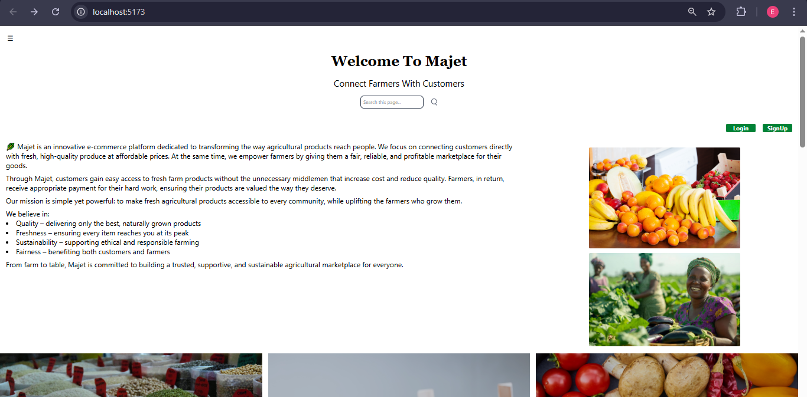
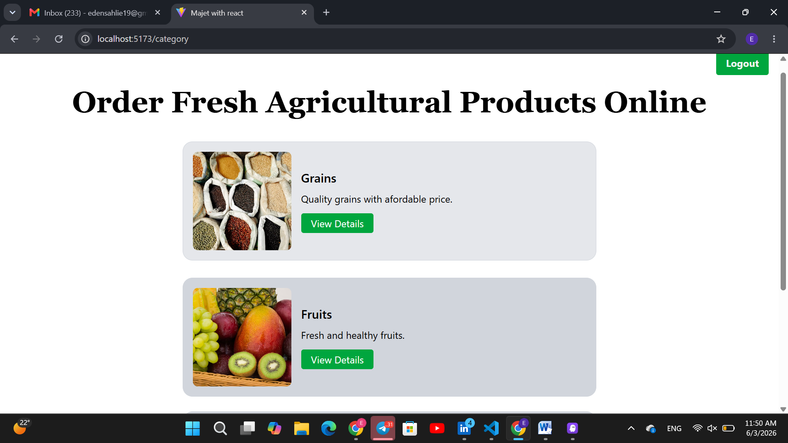
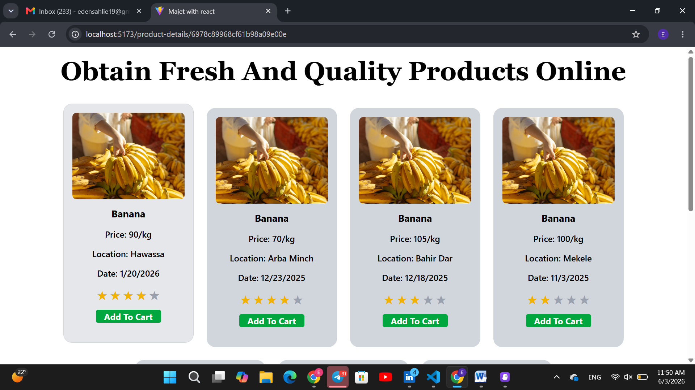

🌾 Majet E-Commerce (Customer Interface)
📌 Project Overview

This project is a customer-facing web interface for Majet project.
It allows customers to browse, search, and interact with agricultural products through a modern and user-friendly web application.

The project is currently focused on the frontend implementation using React, with plans to integrate a backend system in the future to support authentication, orders, and payments.

🎯 Objectives

Provide an intuitive interface for customers to explore agricultural products

Support local farmers and agricultural markets through digital platforms

Apply modern frontend development practices using React

Build a scalable foundation for future full-stack development

🛠️ Technologies Used
Current

Frontend: React.js

Styling: Tailwind CSS

State Management: React Hooks

Routing: React Router

Version Control: Git & GitHub

Planned (Future)

Backend: Node.js & Express

Database: MongoDB / Firebase

Authentication: JWT / Firebase Auth

Payments: Online payment integration

✨ Features

Product listing for agricultural goods

Product details view

Search and category filtering

Responsive design for mobile and desktop

Clean and user-friendly UI

(More features will be added after backend integration)

📂 Project Structure
NEWREACT/
│── src/
|   ├──assets/
│   ├── components/
|   ├──context/
|   ├──data/
|   ├──my category/
│   ├── pages/
│   ├── product/
│   ├── subPages/
│   ├── App.jsx
│   └── main.jsx
│── public/
│── package.json
|── postcss.config.cjs
│── README.md
|── tailwind.config.js
|── vite.config.js

🚀 Installation & Setup

Clone the repository:

git clone https://github.com/your-username/agro-ecommerce.git

Navigate to the project directory:

cd newreact

Install dependencies:

npm install

Start the development server:

npm run dev

📸 Screenshots

#Home Page

#Category Page

#Product Group Page

)
#Detail Page

🧠 Learning Outcomes

Developed a real-world React application

Improved understanding of component-based architecture

Learned client-side routing and state handling

Gained experience designing e-commerce user interfaces

🔮 Future Enhancements

Backend API integration

User authentication (in the login & signup)

Shopping cart and checkout system

Order tracking

Admin dashboard for product management

Payment gateway integration

👤 Author

Eden Sahlie

GitHub: https://github.com/Eden1916

LinkedIn: https://linkedin.com/in/eden-sahlie-729b45357
